# 🌐 Web Application Penetration Testing & Vulnerability Analysis

⚠️ **Disclaimer:** This project is for educational and defensive security purposes only. All testing was performed in a controlled environment.

---

## 📌 Project Overview

This project demonstrates the identification and exploitation of common web application vulnerabilities in a controlled testing environment.

---

## 🧠 Skills Demonstrated

- Web application penetration testing  
- SQL Injection (SQLi)  
- Command Injection  
- Cross-Site Scripting (XSS)  
- Backdoor access techniques  
- Risk analysis and mitigation  

---

# 🧨 Vulnerabilities Identified

---

## 🔓 1. SQL Injection (SQLi)

### 📖 Description
SQL Injection allows attackers to manipulate database queries and bypass authentication.

---

### 💥 Exploit Example

```sql
' OR '1'='1
```

---
### 🖼️ Exploitation Evidence

<p align="center">
  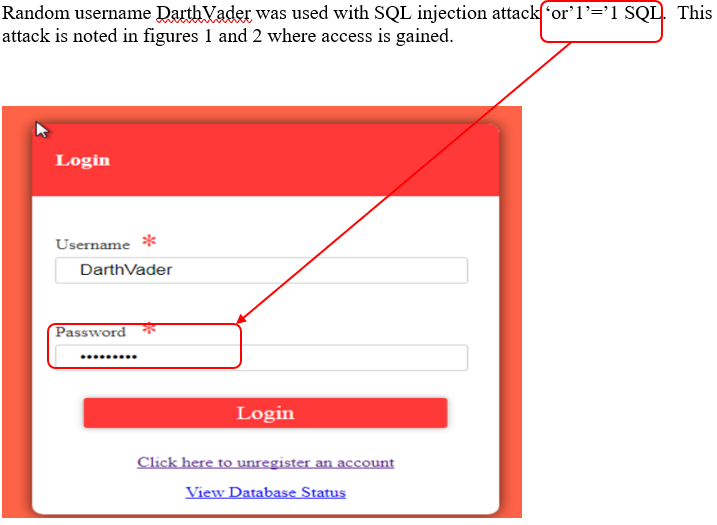
</p>

<p align="center"><em>Figure 1: SQL Injection Login Bypass using authentication bypass payload</em></p>
---
🔎 Risk Impact
Severity: Critical
Risk: Authentication bypass
Impact: Unauthorized database access
🛡️ Mitigation
Parameterized queries
Input validation
ORM frameworks

---
🔑 2. Backdoor Access
📖 Description

Attackers create persistent access by inserting a new user via SQL injection.

💥 Exploit Example
```sql
1; INSERT INTO users VALUES(...)
```

---
### 🖼️ Exploitation Evidence

<p align="center">
  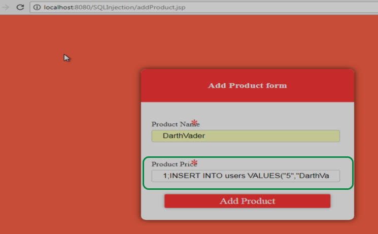
</p>

<p align="center"><em>Figure 3: SQL injection used to insert a malicious user account</em></p>

<p align="center">
  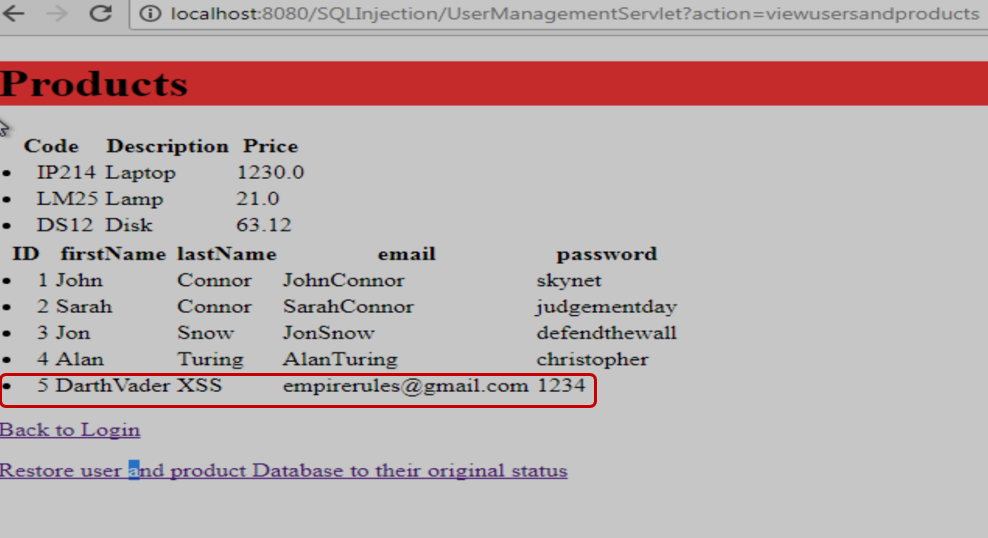
</p>

<p align="center"><em>Figure 4: Persistent backdoor account successfully created</em></p>

---
🔎 Risk Impact
Severity: Critical
Risk: Persistent unauthorized access
Impact: Long-term system compromise
🛡️ Mitigation
Input sanitization
Least privilege enforcement
Monitoring for unauthorized account creation

---
💻 3. Command Injection
📖 Description

Command Injection allows attackers to execute arbitrary commands on the database/system.

💥 Exploit Example
```sql
3; UPDATE users SET password = "123" WHERE 1=1
```

---
### 🖼️ Exploitation Evidence

<p align="center">
  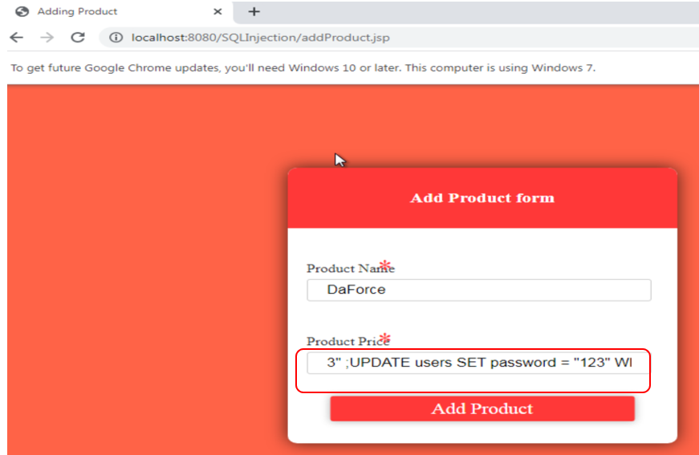
</p>

<p align="center"><em>Figure 5: Malicious input used to modify database records</em></p>

<p align="center">
  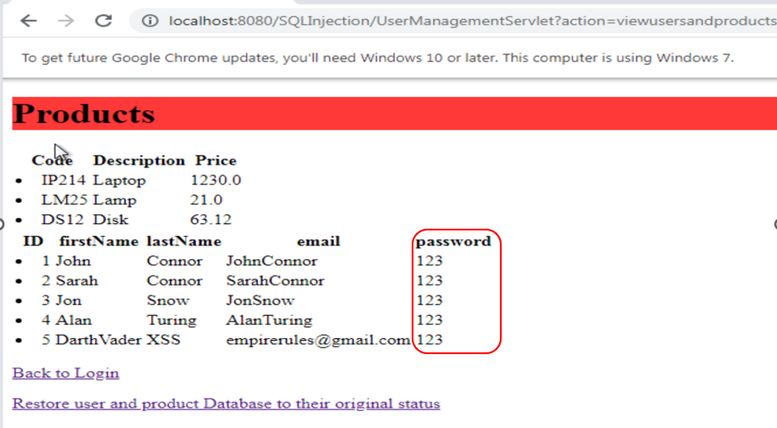
</p>

<p align="center"><em>Figure 6: Result showing all user credentials modified</em></p>

---
🔎 Risk Impact
Severity: Critical
Risk: Full system manipulation
Impact: Credential compromise and system takeover
🛡️ Mitigation
Input validation
Avoid dynamic query execution
Use prepared statements

---
🌐 4. Cross-Site Scripting (XSS)
📖 Description

XSS allows attackers to inject malicious scripts into web pages viewed by users.

💥 Exploit Example
```java
<script>alert("I am infected!!!")</script>
```
---
### 🖼️ Exploitation Evidence

<p align="center">
  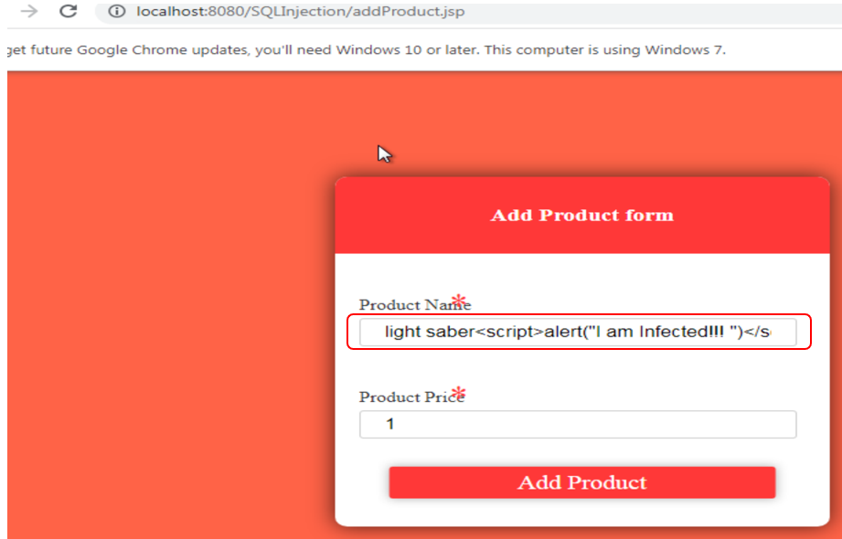
</p>

<p align="center"><em>Figure 7: Script injection into application input field</em></p>

<p align="center">
  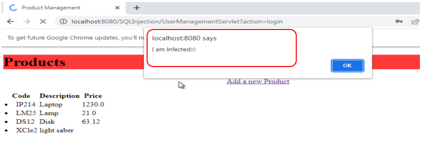
</p>

<p align="center"><em>Figure 8: JavaScript execution in user browser (alert payload)</em></p>

---
🔎 Risk Impact
Severity: High
Risk: Client-side compromise
Impact: Session hijacking, phishing, data theft
🛡️ Mitigation
Output encoding
Input sanitization
Content Security Policy (CSP)

---
💥 5. Denial of Service (DoS) (Optional Demonstration)
📖 Description

DoS attacks remove critical application data, making services unavailable.

💥 Exploit Example
```sql
1; DELETE FROM users;
```
---
### 🖼️ Exploitation Evidence

<p align="center">
  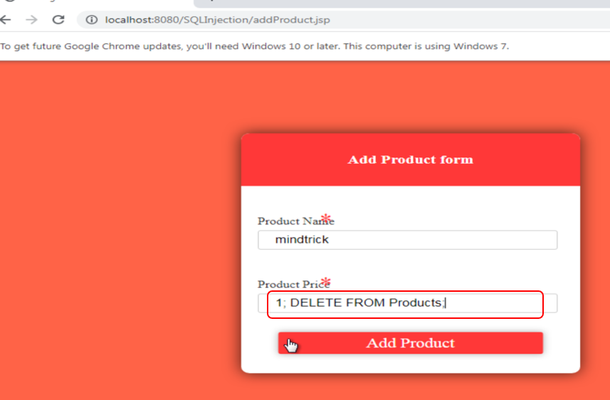
</p>

<p align="center"><em>Figure 9: Malicious query deleting product records</em></p>

<p align="center">
  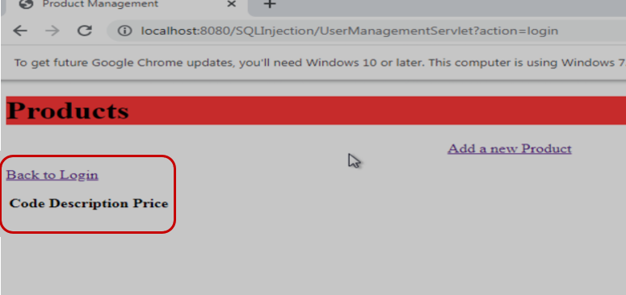
</p>

<p align="center"><em>Figure 10: Confirmation of successful database manipulation</em></p>

<p align="center">
  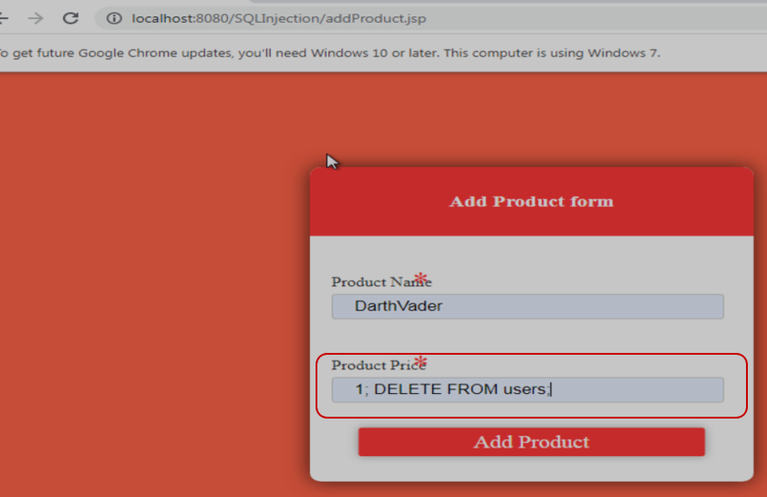
</p>

<p align="center"><em>Figure 11: User records targeted for deletion</em></p>

<p align="center">
  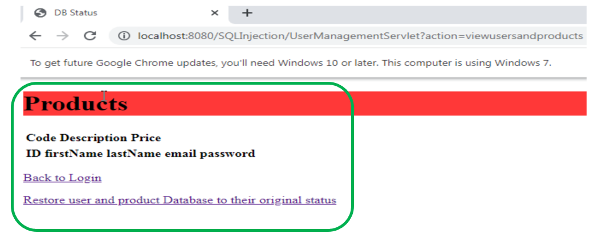
</p>

<p align="center"><em>Figure 12: Final state showing loss of critical application data</em></p>

---
🔎 Risk Impact
Severity: High
Risk: Data destruction
Impact: Loss of availability and integrity
🛡️ Mitigation
Input validation
Role-based access control
Database permissions restrictions
🔎 Risk / Control Mapping
Vulnerability	Risk	Control
SQL Injection	Data exposure	Parameterized queries
Backdoor Access	Persistence	Monitoring & access control
Command Injection	System takeover	Input validation
XSS	Client compromise	Output encoding
DoS	Data loss	Access control

---
🧠 GRC Relevance

This project demonstrates how technical vulnerabilities translate into business risk and how controls mitigate those risks.

🎯 Why This Project Matters
Demonstrates attacker mindset
Shows real exploit paths
Maps vulnerabilities to business impact
Reinforces defensive security practices

---
<br>

📄 Full Report

[Hacking the Website Report](docs/Web Application Penetration Testing_Vulnerability Analysis.docx)


